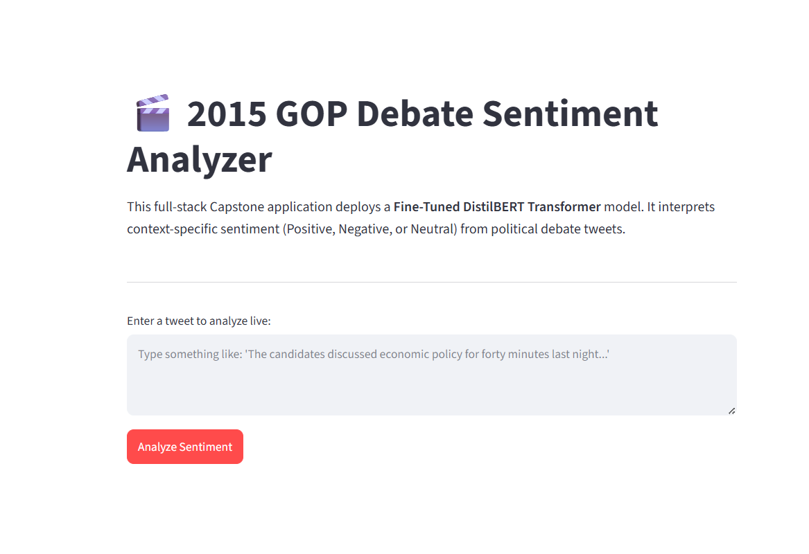

#  Twitter Sentiment Analyzer

An end-to-end NLP web application that classifies political debate tweets into **Positive**, **Negative**, or **Neutral** sentiment using a fine-tuned **DistilBERT** Transformer model.

Built and deployed using **PyTorch**, **Hugging Face Transformers**, and **Streamlit**.

---

## 🚀 Live Demo

🔗 **Live App:** [https://twitter-sentiment-app-bub3jydcednapp5gzkpnfw.streamlit.app/]


---

## 📌 Project Overview

This project analyzes public sentiment from political debate tweets using Natural Language Processing (NLP). A fine-tuned **DistilBERT** model is used to understand contextual meaning and classify tweets into **Positive**, **Negative**, or **Neutral** sentiment.

Compared to traditional machine learning models, DistilBERT captures semantic context more effectively, leading to improved sentiment classification performance.

---

## ✨ Features

- 🚀 Real-time sentiment prediction
- 🤖 Fine-tuned DistilBERT Transformer model
- 😊 Predicts **Positive**, **Negative**, or **Neutral** sentiment
- ⚡ Fast inference using `@st.cache_resource`
- 🌐 Interactive Streamlit web interface
- 💾 Git LFS support for storing model weights

---

## 🛠️ Tech Stack

- **Programming Language:** Python 3.10+
- **Frontend:** Streamlit
- **Deep Learning:** PyTorch
- **NLP:** Hugging Face Transformers
- **Data Processing:** Pandas, NumPy, Regex
- **Model Storage:** Git LFS

---

## 📂 Project Structure

```text
twitter-sentiment-app/
│
├── best_model/                 # Fine-tuned DistilBERT model
│   ├── config.json
│   ├── model.safetensors
│   └── tokenizer.json
│
├── app.py                      # Streamlit application
├── preprocess.py               # Text preprocessing pipeline
├── requirements.txt            # Project dependencies
├── .gitattributes              # Git LFS configuration
└── README.md                   # Project documentation
```

---

## ⚙️ Installation

### 1. Clone the Repository

```bash
git clone https://github.com/ANJANA-K-HUB/twitter-sentiment-app.git
cd twitter-sentiment-app
```

### 2. Create a Virtual Environment

**Windows**

```bash
python -m venv venv
venv\Scripts\activate
```

**macOS/Linux**

```bash
python3 -m venv venv
source venv/bin/activate
```

### 3. Install Dependencies

```bash
pip install -r requirements.txt
```

### 4. Run the Application

```bash
streamlit run app.py
```

The application will open in your browser at:

```
http://localhost:8501
```

---

## 🧠 Model

- **Base Model:** DistilBERT
- **Framework:** Hugging Face Transformers
- **Backend:** PyTorch
- **Task:** Multi-class Sentiment Classification
- **Classes:**
  - 😊 Positive
  - 😐 Neutral
  - 😠 Negative

---

## 📊 Workflow

```text
User Input
      │
      ▼
Text Preprocessing
      │
      ▼
DistilBERT Tokenizer
      │
      ▼
Fine-tuned DistilBERT Model
      │
      ▼
Sentiment Prediction
      │
      ▼
Positive / Neutral / Negative
```

---

## 📦 Dependencies

Major libraries used:

- streamlit
- torch
- transformers
- pandas
- numpy
- scikit-learn
- regex

Install them with:

```bash
pip install -r requirements.txt
```

---

## 📸 Application Preview

Add screenshots here.

```markdown



```

---

## 🎯 Future Improvements

- Support batch sentiment prediction
- Confidence score visualization
- Tweet URL prediction
- Model comparison with BERT and RoBERTa
- Sentiment analytics dashboard

---

## 👩‍💻 Author

**Anjana K**

- GitHub: https://github.com/ANJANA-K-HUB
- LinkedIn: https://www.linkedin.com/in/anjana28/
---

## 📄 License

This project is licensed under the MIT License.

---

## ⭐ If you found this project helpful, consider giving it a star on GitHub!
